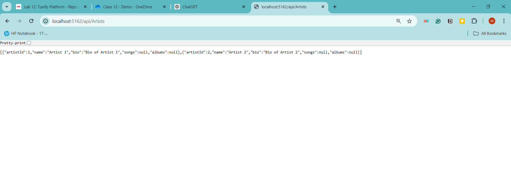

# Tunify Platform

## Introduction

Tunify is a music platform designed to provide users with an exceptional listening experience through a diverse collection of songs, albums, and artists. The application features various functionalities such as creating playlists, managing subscriptions, and keeping up with the latest albums and songs.

## Entity-Relationship Diagram (ERD)

Below is the Entity-Relationship Diagram (ERD) that illustrates the overall data structure and relationships between different entities in the database:

## Overview of Entity Relationships

1. **User**
   - **Properties**: `UserId`, `Username`, `Join_Date`, `Subscription_ID`
   - **Relationships**:
     - A user is associated with one subscription through `Subscription_ID`.
     - A user can have many playlists.

2. **Subscription**
   - **Properties**: `SubscriptionId`, `SubscriptionType`, `Price`
   - **Relationships**:
     - A subscription can have many users associated with it.

3. **PlayList**
   - **Properties**: `PlayListId`, `UserId`, `PlayListName`, `CreatedDate`
   - **Relationships**:
     - A playlist is associated with one user.
     - A playlist can contain many songs through the `PlaylistSong` table.

4. **Song**
   - **Properties**: `SongId`, `Title`, `ArtistId`, `AlbumId`, `Duration`, `Genre`
   - **Relationships**:
     - Each song is associated with a specific artist.
     - Each song belongs to a specific album.
     - A song can appear in many playlists through the `PlaylistSong` table.

5. **Album**
   - **Properties**: `AlbumId`, `AlbumName`, `ReleaseDate`, `ArtistId`
   - **Relationships**:
     - An album is associated with one artist.
     - An album can contain many songs.

6. **Artist**
   - **Properties**: `ArtistId`, `Name`, `Bio`
   - **Relationships**:
     - An artist can have many albums and songs.

7. **PlaylistSong**
   - **Properties**: `SongId`, `PlaylistId`
   - **Relationships**:
     - This table represents the many-to-many relationship between songs and playlists.
     - A playlist can contain many songs, and a song can appear in many playlists.

## Repository Pattern

### Introduction to the Repository Pattern

The Repository Pattern is a design pattern that provides an abstraction over data access logic, making it easier to manage and test. By encapsulating the data access logic in repositories, the application becomes more modular, and the interaction with the data store is separated from the business logic.

### Benefits of Using the Repository Pattern

- **Modularity**: The Repository Pattern helps in organizing the data access logic into separate classes, making the code more modular and easier to maintain.
- **Testability**: By abstracting the data access logic, it becomes easier to write unit tests for the application. The repositories can be mocked during testing, allowing for more focused and isolated tests.
- **Separation of Concerns**: The pattern promotes the separation of concerns by keeping the data access logic separate from the business logic, making the code cleaner and more understandable.
- **Consistency**: Repositories provide a consistent interface for data access operations, making it easier to manage and use different data sources in the future.

### How the Repository Pattern is Implemented in Tunify Platform

In the Tunify Platform application, the Repository Pattern is implemented by creating interfaces and their respective implementations for each entity (User, Playlist, Song, Artist). These repositories are injected into the controllers via constructor injection, ensuring that the controllers only interact with the data access layer through the repository interfaces.

### Example

For example, the `IUserRepository` interface defines the necessary methods for interacting with the User entity. The `UserRepository` class implements this interface, providing the actual data access logic using Entity Framework Core.

public interface IUserRepository
{
    Task<User> GetUserByIdAsync(int id);
    Task<IEnumerable<User>> GetAllUsersAsync();
    Task AddUserAsync(User user);
    Task UpdateUserAsync(User user);
    Task DeleteUserAsync(int id);
}

public class UserRepository : IUserRepository
{
    private readonly TunifyDbContext _context;

    public UserRepository(TunifyDbContext context)
    {
        _context = context;
    }

    // Implementation of the methods defined in the interface
}

 ## Reult Output  

